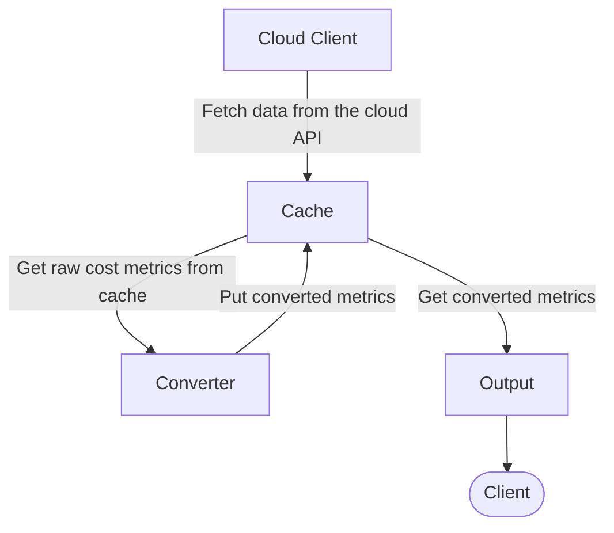

# Cost Exporter

<!-- markdownlint-disable MD013 -->
[](https://github.com/grem11n/cost-exporter/releases/tag/0.0.1)
[](https://github.com/grem11n/cost-exporter/actions/workflows/lint.yaml)
[](https://github.com/grem11n/cost-exporter/actions/workflows/tests.yaml)

Cost Exporter is a small tool that gets your cost and usage metrics from AWS Cost
Explorer and outputs them in the Prometheus format.

[](https://github.com/vshymanskyy/StandWithUkraine/blob/main/docs/README.md)

## Table of Contents

1. [Motivation](#motivation)
2. [Usage](#usage)
   1. [Kubernetes](#kubernetes)
   2. [Configuration](#configuration)
   3. [Prometheus](#prometheus)
3. [Observability](#observability)
   1. [Metrics](#metrics)
   2. [Logs](#logs)
4. [Implementation](#implementation)
5. [Further Thoughts](#further-thoughts)
   1. [Adding More Clients, Converters, and Outputs](#adding-more-clients-converters-and-outputs)
   2. [Other Improvements](#other-improvements)
6. [Contribution](#contribution)
7. [Inspiration](#inspiration)

## Motivation

The main motivation for this project is because I can.

There are other similar projects out there (see the "[Inspiration](#inspiration)" section)
but each of them seems to solve a very special use case of their respective creators.

Thus, I have created another project that solves my special use case!
Also, there is a caveat when working with the AWS Cost Explorer API:
[you have to pay $0.01 for each API call](https://aws.amazon.com/aws-cost-management/aws-cost-explorer/pricing/).
While it doesn't sound like much, it's rather amusing that one has to pay to save costs.

Some of the other projects make AWS API calls ad-hoc when a request for metrics comes.
This can make the whole setup rather expensive for such a simple task.
This project makes calls every hour or day (depends on the metrics granularity),
(see "[Implementation](#implementation)" for more details),
thus reducing the number of API calls to a minimum. These data doesn't change that often anyway.

There is however a general purpose [Cost Exporter by Grafana](https://github.com/grafana/cloudcost-exporter).
You should use that one if you're planning to run things in production,
because it's maintained by an actual company and not a random dude on the internet,
who spends half a year battling the weather-induced depresion.

Still, by the time I discovered the Grafana's exporter, I have already started some work related to this one.
In theory, this exporter should also be fairely extensible both in terms of the cloud probider support (see the
and in terms of the available formats and output methods (see the "[Implementation](#implementation)" section for more information).

However, I work with AWS, so only AWS is supported for now. Also, the metrcs are available
in the Prometheus format on an HTTP endpoint, because this is kind of the industry standard.

## Usage

There is a ready-to-go Helm chart available in the [`charts/cost-exporter`](./charts/cost-exporter/) directory.
However, Cost Exporter is a Go applicaton which also has a Docker image avaialble.
So, you can run it in any environment you want.

### Kubernetes

Cost Exporter comes with a [Helm](https://helm.sh/) chart, so you can deploy into a Kubernetes cluster.
The chart is located in the [`charts/cost-exporter`](./charts/cost-exporter) directory of
this repository.

To install it using the Helm chart, do:

```bash
helm repo add ...
```

```bash
helm upgrade --install cost-exporter charts/cost-exporter --set serviceAccount.awsRoleArn="..."
```

You need to provide an IAM Role ARN, so the Cost Exporter pods can access AWS API,
as well as the required configuration for AWS Cost Explorer.

<!-- textlint-disable -->
For the rest of the available Helm values, see the README in the [chart directory](./charts/cost-exporter/README.md).
<!-- textlint-enable -->

### Configuration

There is an example configuration available in the [`config.example.yaml`](./config.example.yaml) file.

Cost Exporter tries to use sane defaults, so you only really need to care about which metrics
do you want to expose.

### Prometheus

Currently, only the Prometheus format is supported, and the exporter outpts mertics on an HTTP endpoint.
You can configure both the port and the endpoint to scrape the metrics, though.

## Observability

### Metrics

On top of the cost metrics, Cost Explorer also outputs some custom metrics on the same endpoint.
Here's the list of available internal metrics with their types, units and descriptions.

| Metric Name                               | Type        | Unit | Description                               |
| ----------------------------------------- | ----------- | ---- | ----------------------------------------- |
| aws_calls_total                           | `count`     |      | Total calls made to AWS API               |
| aws_get_metrics_duration                  | `histogram` | `ms` | Duration of API calls to AWS              |
| cost_metrics_total                        | `counter`   |      | Total number of the exported cost metrics |
| prometheus_aws_convertion_duration_bucket | `histogram` | `ms` | Time it takes to convert the cost metrics |

### Logs

Cost Exporter uses [Uber's `zap`](https://github.com/uber-go/zap) library to provide structured logs.
You can control the verbosity using the `LOG_LEVEL` environment variable.
Standard log levels are available, e.g. `INFO`, `DEBUG`, `ERROR`, etc.

The default log level is set to `INFO`.

## Implementation

In nutshell, Cost Exporter is just a bunch of control loops that use a single exchange point.

There are three types of loops:

- **Clients**: cloud provider clients, take care of retrieving metrics from the cloud provider API
- **Converters**: take care of converting whatever format a cloud provider provides into th e output format e.g. Prometheus. For now, I assume that while there can be multiple cloud clients, there should be only a single output format
- **Outputs**: "metric sinks", take care of providing converted metrics to the clients

All the loops use a single `sync.Map` as an exchange point.



Clients, converters, and outputs are implemented as registries of plugins.
Thus, it should be relatively easy to add new ones.
However, I personally believe that that is only make sense to have a single converted format per exporter.

Initially, this project was designed around a single cache to decrease the number of AWS API calls,
since [those are paid](https://aws.amazon.com/aws-cost-management/aws-cost-explorer/pricing/).
However, later on I realized that this could be a neat way to make this exporter extensible.

### Implemented so Far

- **Cloud Clients**:
  - AWS
- **Converters**:
  - AWS to Prometheus
- **Outputs**:
  - HTTP listener

## Further Thoughts

### Adding More Clients, Converters, and Outputs

Since each client, converter, and output is essentially a plugin, it's possible to extend this exporter
to support other cloud providers, output formats, and metric sinks.

For example, it should be possible to add a client for Azure or Google Cloud.
However, I am personally not familiar with these providers.
Also, it should be possible to, for example, push metrics to DataDog using their metrics format.

### Other Improvements

There are some things that could be improved in the codebase, e.g.:
- Reduce the amount of hardcode required to set Prometheus labels and metric names
- Automate the sync between the tag creation and Helm chart update somehow

## Contribution

Since it's not particularly likely that I will do any serious updates to this project,
feel free to create a PR!

Otherwise, create an new issue with your feedback and suggestions!

**Release Process**

- Keep the version and the `AppVersion` in the Helm chart in sync
- Preferably, keep the version and the Helm chart version itself also in sync
<!-- textlint-disable -->
- In case of any changes to the Helm chart, make sure to re-generate its README file
- Udpate this README file with the new version icon before releasing
<!-- textlint-enable -->
- Create a new tag and let GHA and GoReleaser do their job

## Inspiration

- [grafana/cloudcost-exporter](https://github.com/grafana/cloudcost-exporter)
- [electrolux-oss/aws-cost-exporter](https://github.com/electrolux-oss/aws-cost-exporter)
- [st8ed/aws-cost-exporter](https://github.com/st8ed/aws-cost-exporter)
- [alanwds/aws-cost-exporter](https://github.com/alanwds/aws-cost-exporter)

## TODO
- [ ] Finish this readme
- [ ] Add CI for Helm
- [ ] Add CI for release
- [ ] Publish artifacts to GHCR
- [ ] Publish the Helm chart to ArtifactsHub
